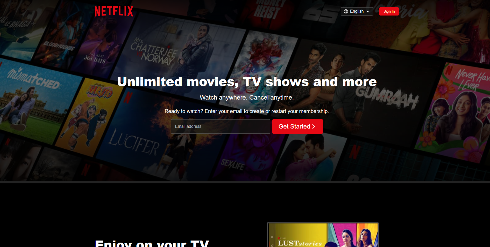

# Beautiful Netflix Clone

Created a Netflix Clone Using HTML And CSS and Javascript and In the project i have covered all this like from frontent to backend and Database.

This amazing web is provided in open source. So, helpful contributions are highly appreciated.

## ScreenShots

|  

---

### :heart: Found this project useful?

If you found this project useful, then please consider giving it a :star: on Github and sharing it with your friends via social media.

---

## Project Created & Maintained By

### Anurag Anand

## Getting Started

Contact me on <a href="mailto:aws.anu.co@gmail.com">Send email</a> to get the full source code.

- clone repo and setup VsCode integration
